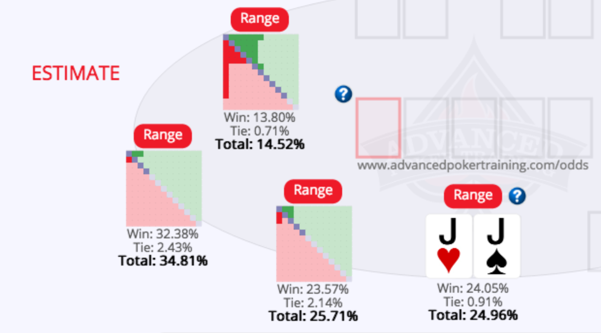
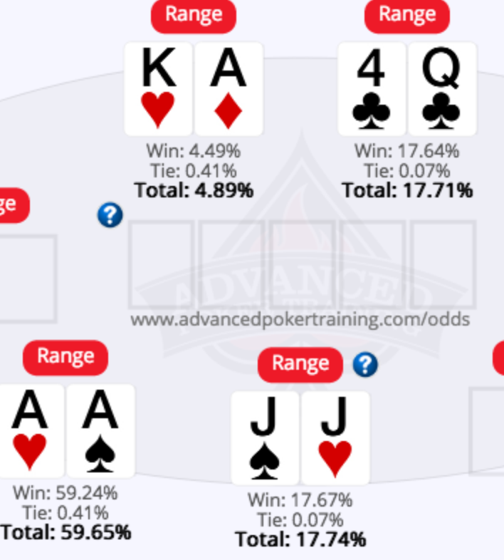

Played in another Graton tournament.  Not the friendliest structure.  10000 starting chips and blinds started at 50/100, so 100 BB.  I lasted 6 levels.

## A small recap:

**My best starting hand** was JJ which had to be folded pre-flop.  A 3-bet and then a all-in 4-bet and a small stack went all in before it got back to me.  I folded. I was against AA, AK and Q4.  I suppose I should have been
glad to fold, even though my J would hit on the turn.

**My best overall hand** was playing J4o from the button...raised it because I just wanted to steal the blinds and one limper's bet from middle position. I got one caller, the big BB.  I got a 4 on the flop and a J on the river to make 2 pair while my caller got top pair on the flop, but didn't raise me.

Otherwise, I **raised a few times** with hands like KQ and didn't get callers.

**My ending came when** the blinds were 400/800 with a 800 big blind ante.  I was on the button.  UTG+1 raised to 2200.  I had about 11K and I thought my AJo was good enough to get a fold or a win.  It wasn't.  I shouldn't have made that play. I think that was my first A I got all day and I
got a little anxious.  I just an AJ win so that might have affected my illusion of winning.  Anyways, that was the hand that I failed in.

Actually there was one other hand that got me.  After winning a decent pot in the 3rd level which got my stack up to 17k.  **I got JTs and raised**. I got min raised from the button.  So I'm out of position and also
with a weak hand if it doesn't hit.  I called and had a gutter after the flop. I called the c-bet and checked the turn
which was a K and no help. Villain also checked.  River was a blank for me. But unknown to me, it was a big help for
him...gave him a full house.  I bet of course to steal the pot...4k...then promptly got an all-in bet.  I folded after
a few seconds.

Well, there was another hand of note.  **45s from the small blind.**  I called and then got a straight flush draw
on the flop along my 4 getting paired. One better and one caller and then I went all in.  Original better called. He
had the same flush draw but better of course.  He lost.  My 4 held up.

Overall, a tough tournament given the number of hands I folded. I estimated about 13 hands I voluntarily put money in the pot so maybe my VPIP is 20%.  I
c-bet 100% and I didn't 3 bet before flop.  Maybe the hand in which I had JTs
needed a 4bet?  Maybe I should have put my money in with the JJ?  Still have
some questions, but I think it was a good learning experience.

## Some stats

* Looks like my JJ against 3 people (with their appropriate ranges) had about a 25% chance of winning.
  
* In reality it was a less...18%
  